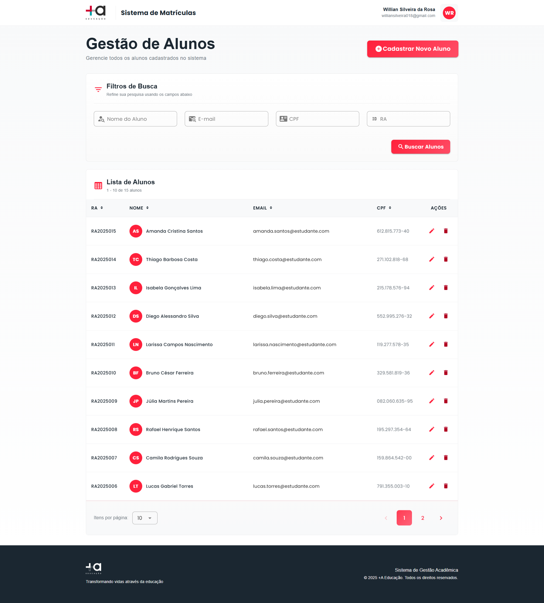
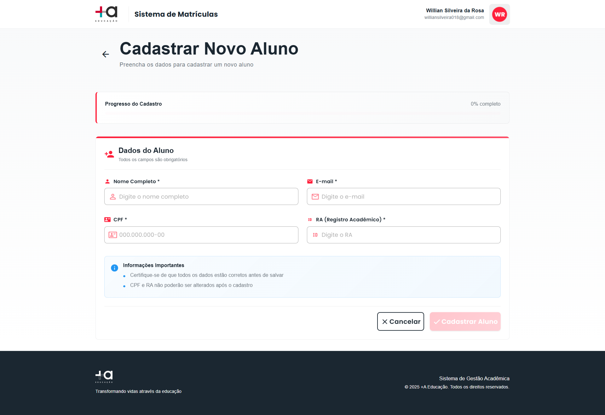
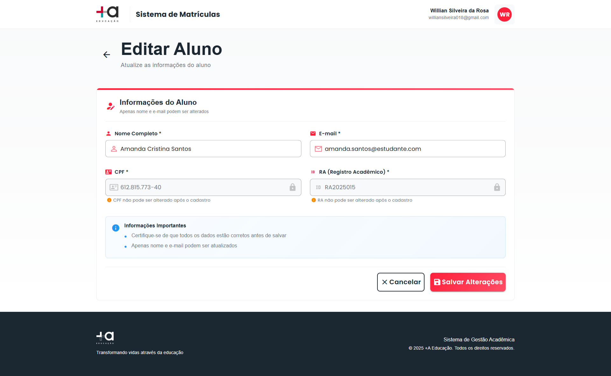
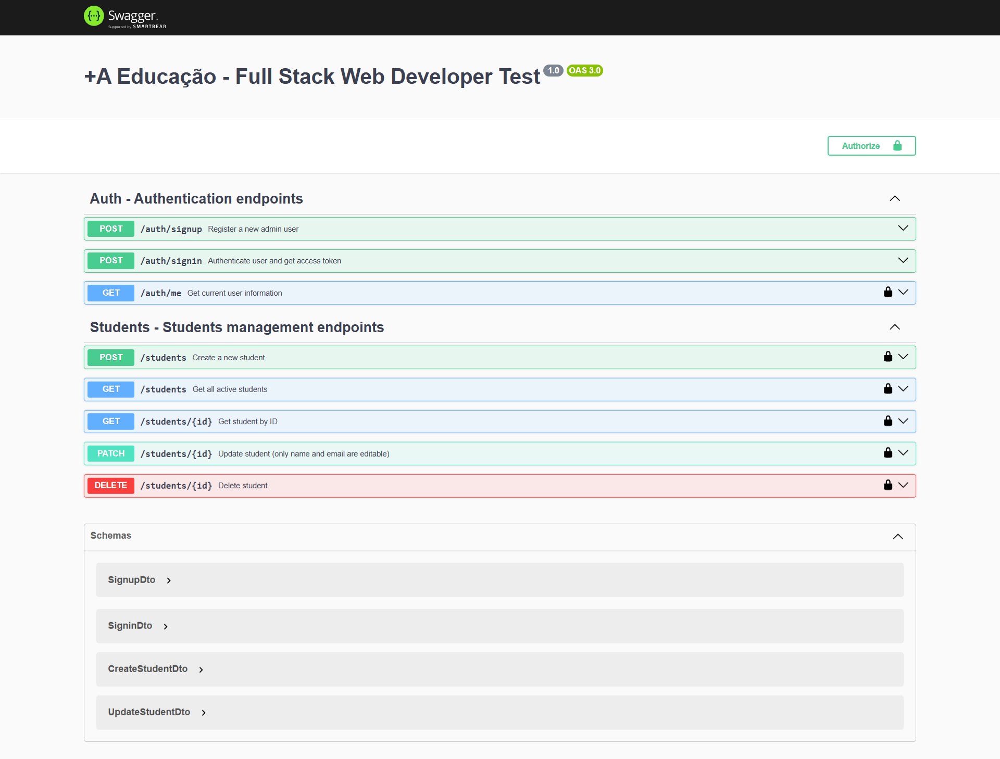

# +A Educação - Full Stack Web Developer Test

## Screenshots da Aplicação

### Frontend - Interface do Usuário

**Tela de Signin:**


**Tela de Signup:**


**Tela de Listagem de Alunos:**


**Tela de Cadastro de Aluno:**


**Tela de Edição de Aluno:**


### Backend - Documentação da API

**Swagger - Documentação Interativa:**  
Faça signin com um usuário admin, copie o código de `accessToken` retornado, clique no botão `Authorize` e cole o código no campo `value` antes de testar as rotas.


## Setup do Projeto

### Pré-requisitos

- Node.js (versão 18+ recomendada)
- Docker e Docker Compose
- Git

### Backend (API)

1. **Configure suas variáveis de ambiente apenas copiando e colando os valores do arquivo `.env.example`.**
2. **Abra o terminal do projeto (api) e utilize os seguintes comandos em ordem:**

   ```bash
    npm install
    npm run docker:setup
    npm run db:generate
    npm run db:migrate:dev
    npm run db:seed
    npm run start:dev
   ```

A API estará disponível em `http://localhost:3000` e a documentação swagger em `http://localhost:3000/api`

### Frontend

1. **Configure suas variáveis de ambiente apenas copiando e colando os valores do arquivo `.env.example`.**
2. **Abra o terminal do projeto (api) e utilize os seguintes comandos em ordem:**

   ```bash
   npm install
   npm run dev
   ```

A aplicação estará disponível em `http://localhost:3001`

### Scripts Úteis

**Backend:**

- `npm run test` - Executa testes unitários
- `npm run test:cov` - Executa testes com cobertura
- `npm run db:studio` - Abre o Prisma Studio
- `npm run db:reset` - Reseta e repopula o banco

**Frontend:**

- `npm run build` - Build de produção
- `npm run type-check` - Verificação de tipos TypeScript

## Decisão da Arquitetura Utilizada

### Backend - Arquitetura em Camadas

**Estrutura Modular com NestJS:**

- **Controllers**: Gerenciamento de endpoints e validação de entrada
- **Services**: Lógica de negócio e validações customizadas
- **Repositories**: Abstração do acesso aos dados com Prisma
- **Guards**: Sistema de autenticação JWT e controle de acesso por roles
- **Interceptors**: Padronização de respostas da API

**Organização:**

```
api/src/
├── modules/           # Auth, Students
├── shared/
│   ├── config/       # Configurações de ambiente
│   ├── database/     # Prisma service e repositories
│   ├── decorators/   # Decorators customizados
│   └── utils/        # Utilitários (validação CPF)
└── prisma/           # Migrations e seeds
```

### Frontend - Arquitetura Simples e Direta

**Estrutura com Vue 3 + Composition API:**

- **Views**: 4 telas principais da aplicação
- **Services**: Comunicação centralizada com a API
- **Stores**: Gerenciamento de estado com composables
- **Router**: Proteção de rotas baseada em autenticação

**Organização:**

```
src/
├── services/         # authService, studentService
├── stores/           # authStore (composables)
├── views/            # Páginas da aplicação
├── router/           # Rotas e guards
└── types/            # Interfaces TypeScript
```

### Justificativas

**Backend**: Arquitetura escalável priorizando separação de responsabilidades. O Repository Pattern facilita futuras mudanças de ORM, e a modularização permite manutenção independente de funcionalidades.

**Frontend**: Arquitetura focada em produtividade e simplicidade, adequada ao prazo. Separação clara entre camadas facilita compreensão e manutenção.

## Lista de Bibliotecas Utilizadas

### Backend

- **@nestjs/core** - Framework Node.js modular
- **@prisma/client** - ORM para PostgreSQL
- **@nestjs/jwt** - Autenticação JWT
- **bcryptjs** - Hash de senhas
- **class-validator** - Validação de DTOs
- **@nestjs/swagger** - Documentação automática
- **jest** - Framework de testes

### Frontend

- **vue** - Framework JavaScript
- **vuetify** - Framework de UI
- **vue-router** - Gerenciamento de rotas
- **axios** - Cliente HTTP
- **typescript** - Tipagem estática
- **vite** - Build tool moderna

## O que Melhoraria com Mais Tempo

Acabei dedicando mais tempo no backend do que no frontend, por isso irei citar mais melhorias para o frontend como um todo.

### Backend

- **Testes da rota /me**: Implementar testes unitários para endpoint de informações do usuário

### Frontend

- **Componentização**: Extrair lógica repetida em componentes reutilizáveis
- **Composables customizados**: Extrair lógica de negócio das views (`useStudentForm`, `usePagination`)
- **Sistema de tema**: Centralizar cores, espaçamentos e tipografia
- **Validações centralizadas**: Sistema de validação reutilizável

## Requisitos Entregues

### ✅ Requisitos Obrigatórios - 100% Implementados

**Funcionalidades CRUD:**

- ✅ Cadastrar novo aluno com validações completas
- ✅ Listar alunos com paginação e filtros
- ✅ Editar cadastro (respeitando campos não-editáveis)
- ✅ Excluir cadastro com confirmação

**Campos e Validações:**

- ✅ Nome (editável, obrigatório)
- ✅ Email (editável, obrigatório, único)
- ✅ RA (não editável, obrigatório, único)
- ✅ CPF (não editável, obrigatório, único, validação matemática)

**Tecnologias:**

- ✅ API Node.js com NestJS
- ✅ Banco PostgreSQL com Prisma
- ✅ Frontend Vue.js + Vuetify
- ✅ Código em inglês

**Qualidade:**

- ✅ Testes unitários (80%+ cobertura)
- ✅ Estrutura organizada
- ✅ Validações robustas
- ✅ Documentação da API (Swagger)
- ✅ Git Flow com commits semânticos

### ✅ Diferenciais Implementados

**Segurança:**

- ✅ Sistema de autenticação JWT completo
- ✅ Controle de acesso baseado em roles (Admin/Student)
- ✅ Hash de senhas com bcryptjs

**DevOps e Produtividade:**

- ✅ Containerização Docker
- ✅ Seeds automáticos com dados realistas
- ✅ TypeScript em 100% do projeto

**UX/UI:**

- ✅ Interface moderna com animações
- ✅ Filtros avançados e ordenação
- ✅ Responsividade completa
- ✅ Feedback visual (snackbars, loading states)

**Arquitetura:**

- ✅ Repository Pattern
- ✅ Decorators customizados
- ✅ Interceptor de resposta padronizado
- ✅ Composables para estado global

### 🚫 Nenhum Requisito Obrigatório Foi Deixado de Fora

Todos os requisitos especificados no desafio foram implementados com sucesso, além de diversos diferenciais que agregam valor ao projeto.

### Contato

**Desenvolvedor:** Willian Silveira da Rosa  
**LinkedIn:** linkedin.com/in/willian-sdr  
**Email:** williansilveira018@gmail.com
